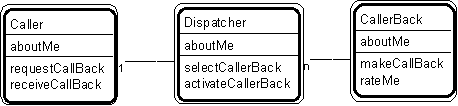

# Patt#30. &quot;Caller - Dispatcher - Caller Back&quot; Pattern // interaction patterns 

  

# Typical object interactions 

* caller.requestCallBack --&gt; dispatcher.selectCallerBack --&gt; rateMe, followed by . . .
* dispatcher.activateCallerBack --&gt; callerBack.makeCallBack --&gt; caller.receiveCallBack

# Examples

* customer - taxi dispatcher - taxi (in a simulation system)
* inbound call - call back server - call back unit

* requester - job shop - contractor (in a simulation system).

# Combinations 

* Superimpose upon three (or more) interacting pattern players.

*  [Interaction patterns](./interaction-patterns.md) 
*  [Patterns for building object models](./patterns-for-building-object-models.md) 

