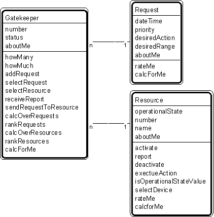

# Patt#31. &quot;Gatekeeper-Request-Resource&quot; Pattern // interaction patterns 

  

# Typical object interactions 

* - for gatekeeper and request

1. - - addRequest --&gt; create
1. - - selectRequest --&gt; rateMe
1. - - rankRequests --&gt; rateMe
1. - for gatekeeper and resource

1. - - sendRequestToResource --&gt; executeRequest
1. - - selectResource --&gt; rateMe

# Examples 

1. comm line gatekeeper - comm line request - comm line.

# Combinations 

*  [Pattern #2.](./2-actor-participant-pattern-transaction-patterns.md) &quot;Actor-Participant&quot; (participant = gatekeeper)
*  [Pattern #3.](./3-participant-transaction-pattern-transaction-patterns.md) &quot;Participant-Transaction&quot; (participant = gatekeeper)
*  [Pattern #5.](./5-specific-item-transaction-pattern-transaction-patterns.md) &quot;Specific Item - Transaction&quot; (specific item = resource).
*  [Interaction patterns](./interaction-patterns.md) 
*  [Patterns for building object models](./patterns-for-building-object-models.md) 

