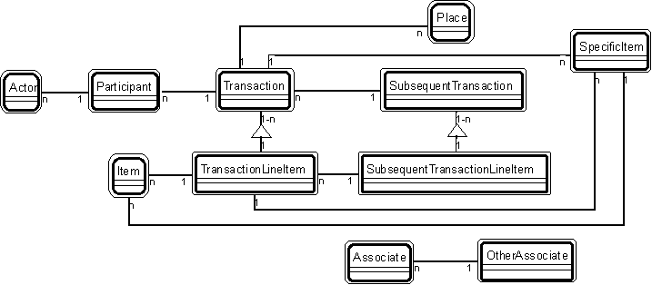

---

title: Transaction patterns

---

Transaction Patterns 

Transaction patterns are those patterns that have a transaction player -- or have
players that commonly play with a transaction player. 

The transaction patterns are: 

* [](Strpat00000060.html">Patt#2.</a> Actor-Participant 

* [](Strpat00000061.html">Patt#3.</a> Participant-Transaction 

* [](Strpat00000062.html">Patt#4.</a> Place-Transaction 

* [](Strpat00000063.html">Patt#5.</a> Specific Item - Transaction 

* [](Strpat00000064.html">Patt#6.</a> Transaction - Transaction Line Item 

* [](Strpat00000065.html">Patt#7.</a> Transaction - Subsequent Transaction 

* [](Strpat00000066.html">Patt#8.</a> Transaction Line Item - Subsequent
Transaction Line Item 

* [](Strpat00000067.html">Patt#9.</a> Item - Line Item 

* [](Strpat00000068.html">Patt#10.</a> Specific Item - Line Item 

* [](Strpat00000069.html">Patt#11.</a> Item - Specific Item 

* [](Strpat00000070.html">Patt#12.</a> Associate - Other Associate 

* [](Strpat00000071.html">Patt#13.</a> Specific Item - Hierarchical Item. 

Here's an overview of transaction patterns, illustrating how they can interconnect with
one another: 

 

* [](Strpat00000056.html">Patterns for building object models</a></li>

