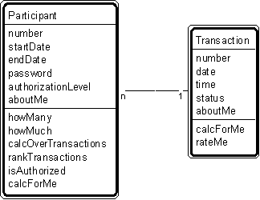

---

title: #3. &quot;Participant-Transaction&quot; Pattern // transaction patterns

---
# Patt#3. &quot;Participant-Transaction&quot; Pattern // transaction patterns 

 

<h2>Typical object interactions </h2>

*  howMany --&gt; calcForMe 

*  howMuch --&gt; calcForMe 

*  calcOverTransactions --&gt; calcForMe 

*  rankTransactions --&gt; rateMe 

<h2>Examples</h2>

*  Participant: agent, applicant, buyer, cashier, clerk, client, civilian, customer,
dealer, delegate, distributor, donor, employee, investor, manufacturer, member, officer,
official, order clerk, owner, participant, policy holder, professional, prospect,
recipient, retailer, sales clerk, sales rep, shipper, student, subscriber, supervisor,
supplier, suspect, teacher, wholesaler, worker. 

*  Transaction: agreement, assignment, authorization, contract, delivery, deposit,
incident, inquiry, order, payment, problem, report, purchase, refund, registration,
rental, reservation, sale, shift, shipment, subscription, time charge, title, withdrawal. 

<h2>Combinations </h2>

* [](Strpat00000060.html"></b>Patt#2.</a> &quot;Actor-Participant&quot; 

* [](Strpat00000061.html">Patt#3.</a> &quot;PatternParticipant-Transaction&quot; 

* [](Strpat00000062.html">Patt#4.</a> &quot;Place-Transaction&quot; 

* [](Strpat00000063.html">Patt#5.</a> &quot;Specific Item - Transaction&quot; 

* [](Strpat00000064.html">Patt#6.</a> &quot;Transaction - Transaction Line
Item&quot; 

* [](Strpat00000065.html">Patt#7.</a> &quot;Transaction - Subsequent
Transaction.&quot; 

Related strategies: 

* [](Strpat00000019.html">#14.</a> &quot;Select Participants&quot; Strategy 

* [](Strpat00000019.html">#17.</a> &quot;Select Transactions&quot; Strategy 

* [](Strpat00000021.html">#34.</a> &quot;Select Kinds of Objects&quot; Strategy 

* [](Strpat00000028.html">#52.</a> &quot;Establish Actor and Participant
Attributes&quot; Strategy 

* [](Strpat00000028.html">#54.</a> &quot;Establish Transaction Attributes&quot;
Strategy 

* [](Strpat00000036.html">#74.</a> &quot;Establish Actor and Participant Object
Connections&quot; Strategy 

* [](Strpat00000036.html">#76.</a> &quot;Establish Transaction Object
Connections&quot; Strategy 

* [](Strpat00000041.html">#94.</a> &quot;Establish Actor and Participant
Services&quot; Strategy 

* [](Strpat00000041.html">#96.</a> &quot;Establish Transaction Services&quot;
Strategy 

* [](Strpat00000059.html">Transaction patterns</a></li>

* [](Strpat00000056.html">Patterns for building object models</a></li>

