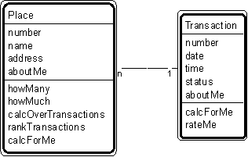

---

title: #4. &quot;Place-Transaction&quot; Pattern // transaction patterns

---
# Patt#4. &quot;Place-Transaction&quot; Pattern // transaction patterns 

 

<h2>Typical object interactions </h2>

*  howMany --&gt; calcForMe 

*  howMuch --&gt; calcForMe 

*  calcOverTransactions --&gt; calcForMe 

*  rankTransactions --&gt; rateMe 

<h2>Examples</h2>

*  Place: airport, assembly-line, airport, bank, clinic, depot, garage, geographic
entity, hangar, hospital, manufacturing site, plant, region, sales outlet, service center,
shelf, station, store, warehouse, zone. 

*  Transaction: agreement, assignment, authorization, contract, delivery, deposit,
incident, inquiry, order, payment, problem, report, purchase, refund, registration,
rental, reservation, sale, shift, shipment, subscription, time charge, title, withdrawal. 

<h2>Combinations </h2>

* [](Strpat00000061.html"></b>Patt#3.</a> &quot;Participant-Transaction&quot; 

* [](Strpat00000063.html">Patt#5.</a> &quot;Specific Item - Transaction&quot; 

* [](Strpat00000064.html">Patt#6.</a> &quot;Transaction - Transaction Line
Item&quot; 

* [](Strpat00000065.html">Patt#7.</a> &quot;Transaction - Subsequent
Transaction&quot;. 

*  Also, using &quot;place&quot; as a container: 

* [](Strpat00000073.html">Patt#14.</a> &quot;Container-Content&quot; 

* [](Strpat00000074.html">Patt#15.</a> &quot;Container - Container Line Item.&quot;

Related strategies: 

* [](Strpat00000019.html">#15.</a> &quot;Select Places&quot; Strategy 

* [](Strpat00000019.html">#17.</a> &quot;Select Transactions&quot; Strategy 

* [](Strpat00000028.html">#53.</a> &quot;Establish Place Attributes&quot;
Strategy 

* [](Strpat00000028.html">#54.</a> &quot;Establish Transaction Attributes&quot;
Strategy 

* [](Strpat00000036.html">#75.</a> &quot;Establish Place Object
Connections&quot; Strategy 

* [](Strpat00000036.html">#76.</a> &quot;Establish Transaction Object
Connections&quot; Strategy 

* [](Strpat00000041.html">#95.</a> &quot;Establish Place Services&quot; Strategy

* [](Strpat00000041.html">#96.</a> &quot;Establish Transaction Services&quot;
Strategy 

* [](Strpat00000059.html">Transaction patterns</a></li>

* [](Strpat00000056.html">Patterns for building object models</a></li>

