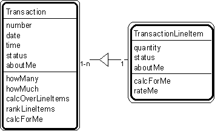

---

title: #6. &quot;Transaction - Transaction Line Item&quot; Pattern // transaction patterns

---
# Patt#6. &quot;Transaction - Transaction Line Item&quot; Pattern // transaction patterns

 

<h2>Typical object interactions </h2>

*  howManyOverInterval --&gt; calcForMe 

*  howMuchOverInterval --&gt; calcForMe 

*  calcOverLineItems --&gt; calcForMe 

*  rankLineItems --&gt; rateMe 

<h2>Examples</h2>

*  Transaction: agreement, assignment, authorization, contract, delivery, deposit,
incident, inquiry, order, payment, problem, report, purchase, refund, registration,
rental, reservation, sale, shift, shipment, subscription, time charge, title, withdrawal. 

*  Transaction - transaction line item: deposit - deposit line item; order - order line
item; payment - payment line item; rental - rental line item; sale - sale line item;
shipment - shipment line item; withdrawal - withdrawal line item. 

<h2>Combinations </h2>

* [](Strpat00000061.html"></b>Patt#3.</a> &quot;Participant-Transaction&quot; 

* [](Strpat00000062.html">Patt#4.</a> &quot;Place-Transaction&quot; 

* [](Strpat00000063.html">Patt#5.</a> &quot;Specific Item - Transaction&quot; 

* [](Strpat00000065.html">Patt#7.</a> &quot;Transaction - Subsequent
Transaction&quot; 

* [](Strpat00000066.html">Patt#8.</a> &quot;Transaction Line Item - Subsequent
Transaction Line Item&quot; 

* [](Strpat00000067.html">Patt#9.</a> &quot;Item - Line Item&quot; 

* [](Strpat00000068.html">Patt#10.</a> &quot;Specific Item - Line Item.&quot; 

Related strategies: 

* [](Strpat00000019.html">#17.</a> &quot;Select Transactions&quot; Strategy 

* [](Strpat00000028.html">#54.</a> &quot;Establish Transaction Attributes&quot;
Strategy 

* [](Strpat00000036.html">#76.</a> &quot;Establish Transaction Object
Connections&quot; Strategy 

* [](Strpat00000041.html">#96.</a> &quot;Establish Transaction Services&quot;
Strategy 

* [](Strpat00000059.html">Transaction patterns</a></li>

* [](Strpat00000056.html">Patterns for building object models</a></li>

