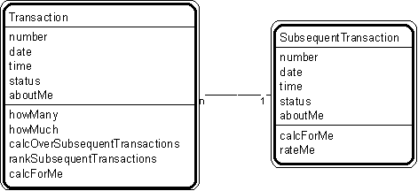

---

title: #7. &quot;Transaction - Subsequent Transaction&quot; Pattern // transaction
patterns

---
# Patt#7. &quot;Transaction - Subsequent Transaction&quot; Pattern // transaction
patterns 

 

<h2>Typical object interactions </h2>

*  howMany --&gt; calcForMe 

*  howMuch --&gt; calcForMe 

*  calcOverSubsequentTransactions --&gt; calcForMe 

*  rankSubsequentTransactions --&gt; rateMe 

<h2>Examples</h2>

*  Transaction: agreement, assignment, authorization, contract, delivery, deposit,
incident, inquiry, order, payment, problem, report, purchase, refund, registration,
rental, reservation, sale, shift, shipment, subscription, time charge, title, withdrawal. 

*  Transaction - subsequent transaction: application-issue; intermediate result - final
result; order-shipment; purchase-payment; reservation-sale; traffic citation - payment. 

<h2>Combinations </h2>

* . 

*  If subsequent transaction and its line item objects correspond 1-to-1 with
transaction and its line item objects, combine them. 

Related strategies: 

* [](Strpat00000019.html">#17.</a> &quot;Select Transactions&quot; Strategy 

* [](Strpat00000028.html">#54.</a> &quot;Establish Transaction Attributes&quot;
Strategy 

* [](Strpat00000036.html">#76.</a> &quot;Establish Transaction Object
Connections&quot; Strategy 

* [](Strpat00000041.html">#96.</a> &quot;Establish Transaction Services&quot;
Strategy 

* [](Strpat00000059.html">Transaction patterns</a></li>

* [](Strpat00000056.html">Patterns for building object models</a></li>

