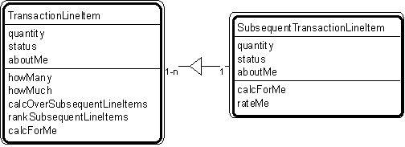

---

title: #8. &quot;Transaction Line Item - Subsequent Transaction Line Item&quot; Pattern //
transaction patterns

---
# Patt#8. &quot;Transaction Line Item - Subsequent Transaction Line Item&quot; Pattern //
transaction patterns 

 

<h2>Typical object interactions </h2>

*  howMany --&gt; calcForMe 

*  howMuch --&gt; calcForMe 

*  calcOverSubsequentLineItems --&gt; calcForMe 

*  rankTransactions --&gt; rateMe 

<h2>Examples</h2>

*  Transaction line items: agreement, assignment, authorization, contract, delivery,
deposit, incident, inquiry, order, payment, problem report, purchase, refund,
registration, rental, reservation, sale, shift, shipment, subscription, time charge,
title, withdrawal. 

*  Transaction line item - subsequent transaction line item: order line item - shipment
line item; reservation line item - rental line item; shipment line item - delivery line
item. 

<h2>Combinations </h2>

* [](Strpat00000064.html"></b>Patt#6.</a> &quot;Transaction - Transaction Line
Item&quot; 

* [](Strpat00000067.html">Patt#9.</a> &quot;Item - Line Item&quot; 

* [](Strpat00000068.html">Patt#10.</a> &quot;Specific Item - Line Item.&quot; 

Related strategies: 

* [](Strpat00000019.html">#17.</a> &quot;Select Transactions&quot; Strategy 

* [](Strpat00000028.html">#54.</a> &quot;Establish Transaction Attributes&quot;
Strategy 

* [](Strpat00000036.html">#76.</a> &quot;Establish Transaction Object
Connections&quot; Strategy 

* [](Strpat00000041.html">#96.</a> &quot;Establish Transaction Services&quot;
Strategy 

* [](Strpat00000059.html">Transaction patterns</a></li>

* [](Strpat00000056.html">Patterns for building object models</a></li>

