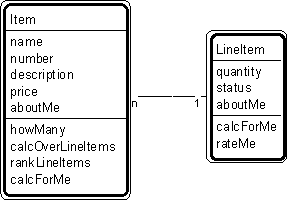

---

title: #9. &quot;Item - Line Item&quot; Pattern // transaction patterns

---
# Patt#9. &quot;Item - Line Item&quot; Pattern // transaction patterns 

 

<h2>Typical object interactions </h2>

*  howMany --&gt; getQuantity 

*  calcOverLineItems --&gt; calcForMe 

*  rankLineItems --&gt; rateMe 

<h2>Examples</h2>

*  (with transaction line items) item - order line item; item - payment line item;
item - rental line item; item - sale line item; item - shipment line item (with container
line items) item - bin line item; item - warehouse line item. 

<h2>Combinations </h2>

* [](Strpat00000064.html"></b>Patt#6.</a> &quot;Transaction - Transaction Line
Item&quot; 

* [](Strpat00000066.html">Patt#8.</a> &quot;Transaction Line Item - Subsequent
Transaction Line Item&quot; 

* [](Strpat00000074.html">Patt#15.</a> &quot;Container - Container Line Item.&quot;

Related strategies: 

* [](Strpat00000019.html">#16.</a> &quot;Select Tangible Things&quot; Strategy 

* [](Strpat00000019.html">#19.</a> &quot;Select Items and Specific Items&quot;
Strategy 

* [](Strpat00000028.html">#55.</a> &quot;Establish Item and Specific Item
Attributes&quot; Strategy 

* [](Strpat00000036.html">#77.</a> &quot;Establish Item and Specific Item Object
Connections&quot; Strategy 

* [](Strpat00000041.html">#97.</a> &quot;Establish Item &amp; Specific Item
Services&quot; Strategy 

* [](Strpat00000059.html">Transaction patterns</a></li>

* [](Strpat00000056.html">Patterns for building object models</a></li>

