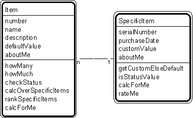

---

title: #11. &quot;Item - Specific Item&quot; Pattern // transaction patterns

---
# Patt#11. &quot;Item - Specific Item&quot; Pattern // transaction patterns 

 

<h2>Typical object interactions </h2>

*  howMany --&gt; calcForMe 

*  checkStatus --&gt; isStatusValue 

*  calcOverSpecificItems --&gt; calcForMe 

*  rankSpecificItems --&gt; rateMe 

*  getDefaultValue &lt;-- getCustomElseDefault 

<h2>Examples</h2>

*  aircraft - specific aircraft; loan description - specific loan; job description -
specific job; video description - videotape; price category - item - specific item
(pattern, applied twice); tax category - item - specific item (pattern, applied twice). 

<h2>Combinations </h2>

* [](Strpat00000063.html"></b>Patt#5.</a> &quot;Specific Item - Transaction&quot; 

* [](Strpat00000067.html">Patt#9.</a> &quot;Item - Line Item.&quot; 

Related strategies: 

* [](Strpat00000019.html">#16.</a> &quot;Select Tangible Things&quot; Strategy 

* [](Strpat00000019.html">#19.</a> &quot;Select Items and Specific Items&quot;
Strategy 

* [](Strpat00000028.html">#55.</a> &quot;Establish Item and Specific Item
Attributes&quot; Strategy 

* [](Strpat00000036.html">#77.</a> &quot;Establish Item and Specific Item Object
Connections&quot; Strategy 

* [](Strpat00000041.html">#97.</a> &quot;Establish Item &amp; Specific Item
Services&quot; Strategy 

* [](Strpat00000059.html">Transaction patterns</a></li>

* [](Strpat00000056.html">Patterns for building object models</a></li>

