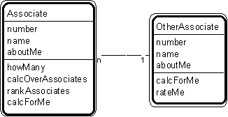

---

title: #12. &quot;Associate - Other Associate&quot; Pattern // transaction patterns

---
# Patt#12. &quot;Associate - Other Associate&quot; Pattern // transaction patterns 

 

<h2>Typical object interactions </h2>

*  howMany --&gt; calcForMe 

*  calcOverOtherAssociates --&gt; calcForMe 

*  rankOtherAssociates --&gt; rateMe 

<h2>Examples</h2>

*  aileron-gyro; aircraft-runway; building-sensor; driver-vehicle; loading dock -
order; order-tote; truck - loading dock. 

<h2>Combinations </h2>

*  any other pattern. 

Notes 

*  Associates are objects that know each other, without a need for information about
that association or history about it. 

*  In some pattern instances, an &quot;other associate&quot; may need to know some
number of associates. 

Related strategy: [](Strpat00000019.html">#18.</a> &quot;Select
Associates&quot; 

* [](Strpat00000059.html">Transaction patterns</a></li>

* [](Strpat00000056.html">Patterns for building object models</a></li>

