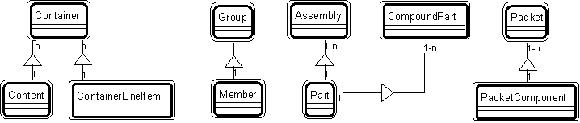

---

title: Aggregate patterns

---

Aggregate patterns 

The aggregate patterns are: 

* [](Strpat00000073.html">Patt#14.</a> Container-Content 

* [](Strpat00000074.html">Patt#15.</a> Container - Container Line Item 

* [](Strpat00000075.html">Patt#16.</a> Group-Member 

* [](Strpat00000076.html">Patt#17.</a> Assembly-Part 

* [](Strpat00000077.html">Patt#18.</a> Compound Part - Part 

* [](Strpat00000078.html">Patt#19.</a> Packet - Packet Component 

These patterns interconnect with other patterns, sometimes with the help of the
&quot;associate - other associate&quot; transaction pattern. 

Here's an overview of aggregate patterns: 

 

* [](Strpat00000056.html">Patterns for building object models</a></li>

