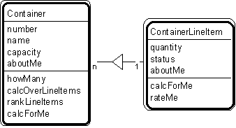

---

title: #15. &quot;Container - Container Line Item&quot; Pattern // aggregate patterns

---
# Patt#15. &quot;Container - Container Line Item&quot; Pattern // aggregate patterns 

 

<h2>Typical object interactions </h2>

*  howMany --&gt; calcForMe 

*  calcOverLineItems --&gt; calcForMe 

*  rankLineItems --&gt; rateMe 

<h2>Examples</h2>

*  aircraft - aircraft line item; bin - bin line item; warehouse - warehouse line
item. 

<h2>Combinations </h2>

* [](Strpat00000067.html"></b>Patt#9.</a> &quot;Item - Line Item&quot; 

* [](Strpat00000068.html">Patt#10.</a> &quot;Specific Item - Line Item.&quot; 

*  Also, when &quot;container&quot; is a participant, place, or specific item: 

* [](Strpat00000060.html">Patt#2.</a> &quot;Actor-Participant&quot; 

* [](Strpat00000061.html">Patt#3.</a> &quot;Participant-Transaction&quot; 

* [](Strpat00000062.html">Patt#4.</a> &quot;Place-Transaction&quot; 

* [](Strpat00000063.html">Patt#5.</a> &quot;Specific Item - Transaction&quot; 

* [](Strpat00000069.html">Patt#11.</a> &quot;Item - Specific Item.&quot; 

Notes 

*  When working with containers within containers, apply this pattern to the
smallest container in that domain, within your system's responsibilities. 

Related strategies: 

* [](Strpat00000019.html">#22.</a> &quot;Select Container Objects&quot; Strategy

* [](Strpat00000043.html">#103.</a> &quot;Service in the Smallest Applicable
Container&quot; Strategy 

* [](Strpat00000072.html">Aggregate patterns</a></li>

* [](Strpat00000056.html">Patterns for building object models</a></li>

