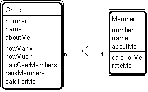

---

title: #16. &quot;Group-Member&quot; Pattern // aggregate patterns

---
# Patt#16. &quot;Group-Member&quot; Pattern // aggregate patterns 

 

<h2>Typical object interactions </h2>

*  howMany --&gt; calcForMe 

*  calcOverMembers --&gt; calcForMe 

*  rankMembers --&gt; rateMe 

<h2>Examples</h2>

*  company-employee; team - team member. 

<h2>Combinations </h2>

*  

* [](Strpat00000073.html">Patt#14.</a> &quot;Container-Content&quot; 

* [](Strpat00000076.html">Patt#17.</a> &quot;Assembly-Part.&quot; 

*  Also, when &quot;group&quot; or &quot;member&quot; is a participant, place, or
specific item: 

* [](Strpat00000060.html">Patt#2.</a> &quot;Actor-Participant&quot; 

* [](Strpat00000061.html">Patt#3.</a> &quot;Participant-Transaction&quot; 

* [](Strpat00000062.html">Patt#4.</a> &quot;Place-Transaction&quot; 

* [](Strpat00000063.html">Patt#5.</a> &quot;Specific Item - Transaction&quot; 

* [](Strpat00000068.html">Patt#10.</a> &quot;Specific Item - Line Item&quot; 

* [](Strpat00000069.html">Patt#11.</a> &quot;Item - Specific Item.&quot; 

Related strategy: [](Strpat00000023.html">#37.</a> &quot;Select and Reuse a
Group of Interacting Objects&quot; Strategy 

* [](Strpat00000072.html">Aggregate patterns</a></li>

* [](Strpat00000056.html">Patterns for building object models</a></li>

