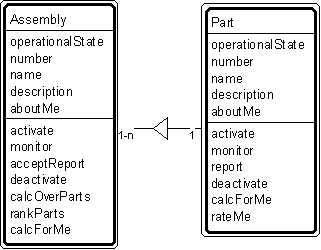

---

title: #17. &quot;Assembly-Part&quot; Pattern // aggregate patterns

---
# Patt#17. &quot;Assembly-Part&quot; Pattern // aggregate patterns 

 

<h2>Typical object interactions </h2>

*  monitor --&gt; monitor 

*  acceptReport &lt;-- report 

*  calcOverParts --&gt; calcForMe 

*  rankParts --&gt; rateMe 

<h2>Examples</h2>

*  aircraft-engine; engine - engine part. 

<h2>Combinations </h2>

*  

* [](Strpat00000073.html">Patt#14.</a> &quot;Container-Content&quot; 

* [](Strpat00000075.html">Patt#16.</a> &quot;Group-Member&quot; 

* [](Strpat00000077.html">Patt#18.</a> &quot;Compound Part - Part.&quot; 

*  Also, when &quot;assembly&quot; or &quot;part&quot; is a specific item: 

* [](Strpat00000063.html">Patt#5.</a> &quot;Specific Item - Transaction&quot; 

* [](Strpat00000068.html">Patt#10.</a> &quot;Specific Item - Line Item&quot; 

* [](Strpat00000069.html">Patt#11.</a> &quot;Item - Specific Item.&quot; 

Related strategy: [](Strpat00000019.html">#21.</a> &quot;Select Collections of
Objects&quot; Strategy 

* [](Strpat00000072.html">Aggregate patterns</a></li>

* [](Strpat00000056.html">Patterns for building object models</a></li>

