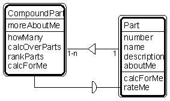

---

title: #18. &quot;Compound Part - Part&quot; Pattern // aggregate patterns

---
# Patt#18. &quot;Compound Part - Part&quot; Pattern // aggregate patterns 

 

<h2>Typical object interactions </h2>

*  howMany --&gt; calcForMe 

*  calcOverParts --&gt; calcForMe 

*  rankParts --&gt; rateMe 

<h2>Examples</h2>

*  compound part - part; electronic assembly - electronic part; hardware assembly -
hardware part. 

<h2>Combinations </h2>

* [](Strpat00000076.html"></b>Patt#17.</a> &quot;Assembly-Part&quot; 

Also, when &quot;compound part&quot; or &quot;part&quot; is treated as a specific item:

* [](Strpat00000063.html">Patt#5.</a> &quot;Specific Item - Transaction&quot; 

* [](Strpat00000068.html">Patt#10.</a> &quot;Specific Item - Line Item&quot; 

* [](Strpat00000069.html">Patt#11.</a> &quot;Item - Specific Item.&quot; 

* [](Strpat00000072.html">Aggregate patterns</a></li>

* [](Strpat00000056.html">Patterns for building object models</a></li>

