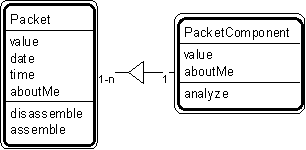

---

title: #19. &quot;Packet - Packet Component&quot; Pattern // aggregate patterns

---
# Patt#19. &quot;Packet - Packet Component&quot; Pattern // aggregate patterns 

 

<h2>Typical object interactions </h2>

*  disassemble --&gt; create 

*  assemble --&gt; getValue 

<h2>Examples</h2>

*  record-field, message-token, telemetry packet - telemetry component 

<h2>Combinations </h2>

*  When a &quot;packet component&quot; is treated as a specific item: 

* [](Strpat00000063.html">Patt#5.</a> &quot;Specific Item - Transaction&quot; 

* [](Strpat00000068.html">Patt#10.</a> &quot;Specific Item - Line Item&quot; 

* [](Strpat00000069.html">Patt#11.</a> &quot;Item - Specific Item.&quot; 

* [](Strpat00000072.html">Aggregate patterns</a></li>

* [](Strpat00000056.html">Patterns for building object models</a></li>

