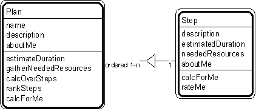

---

title: #20. &quot;Plan-Step&quot; Pattern // plan patterns

---
# Patt#20. &quot;Plan-Step&quot; Pattern // plan patterns 

 

<h2>Typical object interactions </h2>

*  estimateDuration --&gt; getEstimatedDuration 

*  gatherNeededResources --&gt; getNeededResources 

*  calcOverSteps --&gt; calcForMe 

*  rankSteps --&gt; rateMe 

<h2>Examples</h2>

*  Plan: project plan, battle plan, cooking recipe, batch job, procedure 

*  Plan-step: project plan - task, battle plan - tactical steps, recipe - recipe steps,
job - job step, procedure - procedure step 

<h2>Combinations </h2>

* [](Strpat00000081.html"></b>Patt#21.</a> &quot;Plan - Plan Execution&quot; 

* [](Strpat00000082.html">Patt#22.</a> &quot;Step - Step Execution&quot; 

* [](Strpat00000084.html">Patt#24.</a> &quot;Plan - Plan Version.&quot; 

* [](Strpat00000079.html">Plan patterns</a></li>

* [](Strpat00000056.html">Patterns for building object models</a></li>

