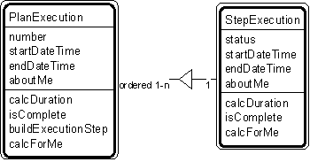

---

title: #23. &quot;Plan Execution - Step Execution&quot; Pattern // plan patterns

---
# Patt#23. &quot;Plan Execution - Step Execution&quot; Pattern // plan patterns 

 

<h2>Typical object interactions </h2>

*  calcDuration --&gt; calcDuration 

*  isComplete --&gt; isComplete 

*  buildExecutionStep --&gt; create 

<h2>Examples</h2>

*  battle execution - tactics execution, recipe execution - recipe step execution,
job execution - job step execution, procedure execution - procedure step execution 

<h2>Combinations </h2>

* [](Strpat00000080.html"></b>Patt#20.</a> &quot;Plan-Step&quot; 

* [](Strpat00000081.html">Patt#21.</a> &quot;Plan - Plan Execution.&quot; 

* [](Strpat00000079.html">Plan patterns</a></li>

* [](Strpat00000056.html">Patterns for building object models</a></li>

