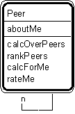

---

title: #25. &quot;Peer-Peer&quot; Pattern // interaction patterns

---
# Patt#25. &quot;Peer-Peer&quot; Pattern // interaction patterns 

 

<h2>Typical object interactions </h2>

*  calcOverPeers --&gt; calcForMe 

*  rankPeers--&gt; rateMe 

<h2>Examples</h2>

*  flight path - crossing flight path; lane - crossing lane; sector-sector (airspace
volumes in air traffic control). 

<h2>Combinations </h2>

*  Superimpose on any pattern player. 

* [](Strpat00000085.html">Interaction patterns</a></li>

* [](Strpat00000056.html">Patterns for building object models</a></li>

