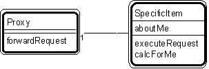

---

title: #26. &quot;Proxy - Specific Item&quot; Pattern // interaction patterns

---
# Patt#26. &quot;Proxy - Specific Item&quot; Pattern // interaction patterns 

 

<h2>Typical object interactions </h2>

 forwardRequest --&gt; executeRequest 

<h2>Examples</h2>

*  object - cached object. </li>

<h2>Combinations</h2>

* [](Strpat00000068.html">Patt#10.</a> &quot;Specific Item - Line Item&quot; 

* [](Strpat00000069.html">Patt#11.</a> &quot;Item - Specific Item.&quot; 

*  Superimpose &quot;specific item&quot; on any pattern player, adding a proxy to it. 

<h2>Notes </h2>

You know the proxy. It does no work of its own. It passes all work to its
corresponding specific item. 

<ul>
* [](Strpat00000085.html">Interaction patterns</a></li>
* [](Strpat00000056.html">Patterns for building object models</a></li>
</ul>

