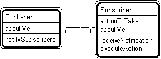

---

title: #27. &quot;Publisher-Subscriber&quot; Pattern // interaction patterns

---
# Patt#27. &quot;Publisher-Subscriber&quot; Pattern // interaction patterns 

 

<h2>Typical object interactions </h2>

*  notifySubscribers --&gt; receiveNotification (which, in turn, invokes
executeAction) 

<h2>Examples</h2>

*  problem-domain object, human-interaction object, data-management object,
system-interaction object 

*  model-document; model-view 

*  &quot;subsystem one&quot; object - &quot;subsystem two&quot; object. 

<h2>Combinations </h2>

*  Superimpose on a problem-domain pattern player (publisher) and its respective
human-interaction, data-management, and system-interaction pattern players (subscribers). 

* [](Strpat00000085.html">Interaction patterns</a></li>

* [](Strpat00000056.html">Patterns for building object models</a></li>

