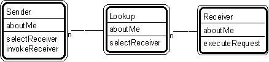

---

title: #29. &quot;Sender-Lookup-Receiver&quot; Pattern // interaction patterns

---
# Patt#29. &quot;Sender-Lookup-Receiver&quot; Pattern // interaction patterns 

 

<h2>Typical object interactions </h2>

*  sender.selectNextReceiver --&gt; lookup.selectReceiver, followed by . . . 

*  sender.invokeReceiver --&gt; receiver.executeRequest 

<h2>Examples</h2>

<ul>
*  saleAnalysisWindow.lookupLineItem --&gt; sale.lookupLineItem, followed by . . . 

*  saleAnalysisWindow.calcLineItemProfit --&gt; sale.calcProfit 

</ul>

<h2>Combinations </h2>

<ul>
*  Superimpose upon participant - transaction - transaction line item. </li>
*  Superimpose upon three (or more) interacting pattern players. </li>
</ul>

<h2>Note </h2>

<ul>
*  This approach keeps lookup object simpler. </li>
* [](Strpat00000085.html">Interaction patterns</a></li>
* [](Strpat00000056.html">Patterns for building object models</a></li>
</ul>

