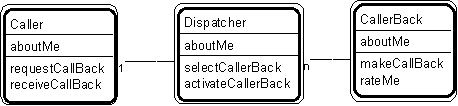

---

title: #30. &quot;Caller - Dispatcher - Caller Back&quot; Pattern // interaction patterns

---
# Patt#30. &quot;Caller - Dispatcher - Caller Back&quot; Pattern // interaction patterns 

 

<h2>Typical object interactions </h2>

<ul>
*  caller.requestCallBack --&gt; dispatcher.selectCallerBack --&gt; rateMe, followed by . . . </li>
*  dispatcher.activateCallerBack --&gt; callerBack.makeCallBack --&gt; caller.receiveCallBack </li>
</ul>

<h2>Examples</h2>

<ul>
* customer - taxi dispatcher - taxi (in a simulation system) </li>
* inbound call - call back server - call back unit 

* requester - job shop - contractor (in a simulation system). </li>
</ul>

<h2>Combinations </h2>

<ul>
* Superimpose upon three (or more) interacting pattern players. 

* [](Strpat00000085.html">Interaction patterns</a></li>
* [](Strpat00000056.html">Patterns for building object models</a></li>
</ul>

