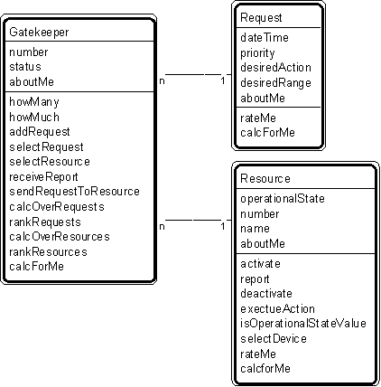

---

title: #31. &quot;Gatekeeper-Request-Resource&quot; Pattern // device patterns

---
# Patt#31. &quot;Gatekeeper-Request-Resource&quot; Pattern // interaction patterns 

 

<h2>Typical object interactions </h2>

<ul>
* - for gatekeeper and request 
	<ol>
		* - - addRequest --&gt; create </li>
		* - - selectRequest --&gt; rateMe </li>
		* - - rankRequests --&gt; rateMe </li>
	</ol>
</li>
	
* - for gatekeeper and resource 
	<ol>
		* - - sendRequestToResource --&gt; executeRequest </li>
		* - - selectResource --&gt; rateMe </li>
	</ol>
</li>
</ul>

<h2>Examples </h2>

*  comm line gatekeeper - comm line request - comm line. 

<h2>Combinations </h2>

<ul>
*  </li>
*  </li>
* . </li>
* [](Strpat00000085.html">Interaction patterns</a></li>
* [](Strpat00000056.html">Patterns for building object models</a></li>
</ul>

