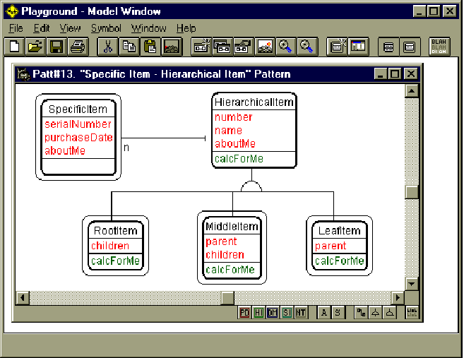

#  Playground 

 

Playground is an object-model whiteboard for analysts and domain experts

Playground (tm) is a low-cost, easy-to-use tool for building object models. It is
especially suited for teams of domain experts and analysts, working together during the
early stages of a new project. It's a great way to get started with building effective
object models.

Features. Drag-and-drop classes, attributes, services, connections; multiple
views, always in-sync; view management, with view categories, selective hiding/showing,
and view update options; full control over connections, including routing points,
right-angled or diagonal connections, and more; and extensive customization with
preferences.

Requirements. 32-bit Windows (Win32s, Win95, WinNT on Intel platform), 8 MB RAM,
5 MB disk space. Max recommended model size: 25 classes.

Tech support for Playground is provided by e-mail (playground@oi.com) or regular
mail only.

Try it out for free. Use Playground for free, for personal study or in the
classroom. You can get the a copy of the &quot;classroom and personal study only&quot;
version from http://www.oi.com/playground.html.

Shareware Honor System. Playground is free for personal study and classroom use.
For all other uses, the shareware fee is $95 per copy. This is done on the honor system;
if it's time to pay up, then please do so. Send your check or money order (sorry, no
credit cards or cash for shareware fees, please) to Object International, Inc., 1720 Leigh
Drive, Raleigh NC 27603 USA. Thank you for your support.

(Playground is a trademark of Object International, Inc.)

