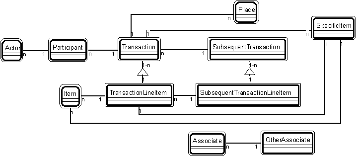

#Transaction Patterns

Transaction patterns are those patterns that have a transaction player -- or have
players that commonly play with a transaction player.

The transaction patterns are:

* [Pattern #2.](./2-actor-participant-pattern-transaction-patterns.html) Actor-Participant
* [Pattern #3.](./3-participant-transaction-pattern-transaction-patterns.html) Participant-Transaction
* [Pattern #4.](./4-place-transaction-pattern-transaction-patterns.html) Place-Transaction
* [Pattern #5.](./5-specific-item-transaction-pattern-transaction-patterns.html) Specific Item - Transaction
* [Pattern #6.](./6-transaction-transaction-line-item-pattern-transaction-patterns.html) Transaction - Transaction Line Item
* [Pattern #7.](./7-transaction-subsequent-transaction-pattern-transactionpatterns.html) Transaction - Subsequent Transaction
* [Pattern #8.](./8-transaction-line-item-subsequent-transaction-line-item-pattern-transaction-patterns.html) Transaction Line Item - Subsequent Transaction Line Item
* [Pattern #9.](./9-item-line-item-pattern-transaction-patterns.html) Item - Line Item
* [Pattern #10.](./10-specific-item-line-item-pattern-transaction-patterns.html) Specific Item - Line Item
* [Pattern #11.](./11-item-specific-item-pattern-transaction-patterns.html) Item - Specific Item
* [Pattern #12.](./12-associate-other-associate-pattern-transaction-patterns.html) Associate - Other Associate
* [Pattern #13.](./13-specific-item-hierarchical-item-pattern-transaction-patterns.html) Specific Item - Hierarchical Item.

Here's an overview of transaction patterns, illustrating how they can interconnect with
one another:

 

* [Patterns for building object models](./patterns-for-building-object-models.md)
